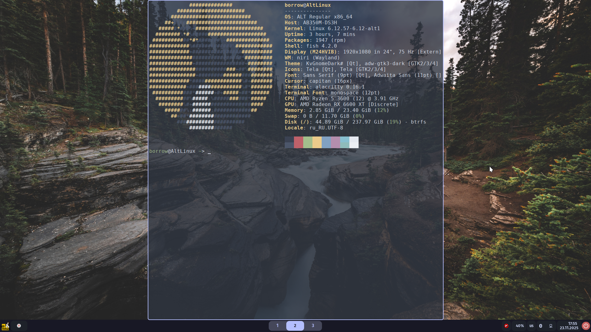
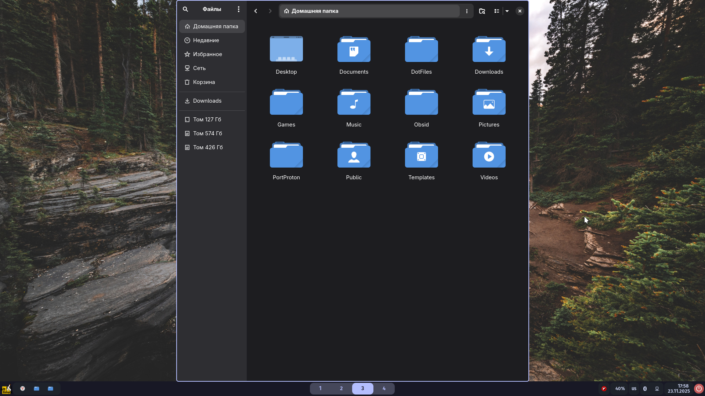
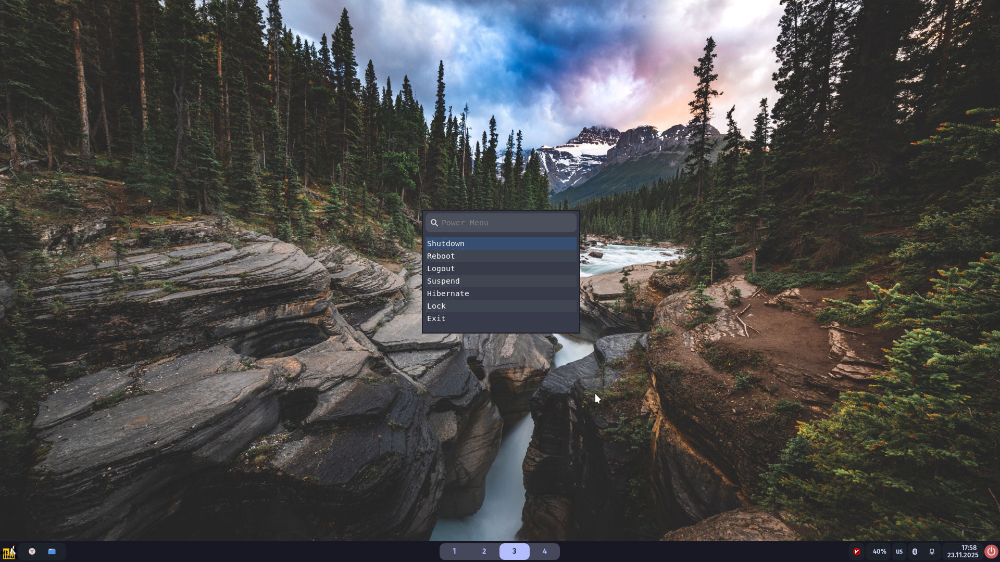

Для niri
<details>
  <summary>Скриншоты</summary>
 




 </details>
 
## Установка
```bash
git clone https://github.com/RobberBobFl/DotFiles.git
```
Из home/.config в ~/.config
Из usr/share в /usr/share/

Темы, курсор, иконки поставить в nwg-look и в Kvantum для qt

Приминить тёмную тему для libadwaita
```bash
dconf write /org/gnome/desktop/interface/color-scheme '"prefer-dark"'
```

## Обязательный софт
Arch
```bash
sudo pacman -S xdg-desktop-portal-gtk xdg-desktop-portal-gnome gnome-keyring xdg-terminal-exec mate-polkit xwayland-satellite
```
Alt
```bash
sudo apt-get install xdg-desktop-portal-gtk xdg-desktop-portal-gnome gnome-keyring xdg-terminal-exec mate-polkit xwayland-satellite
```
- xdg-desktop-portal-gtk
- xdg-desktop-portal-gnome
- gnome-keyring
- xdg-desktop-portal-wlr(Может пригодится)
- xdg-terminal-exec(Если не будет открываться терминал)
- mate-polkit
- mate-polkit
- xwayland-satellite

## Доп. софт для niri
Arch
```bash
sudo pacman -S waybar wofi mako gtklock gtklock-powerbar-module gtklock-playerctl-module wlogout alacritty cliphist wlsunset awww qt5ct qt6ct qt6-wayland qt5-wayland ttf-roboto ttf-fira-code ttf-firacode-nerd
```
Alt
```bash
sudo apt-get install waybar wofi mako gtklock gtklock-powerbar-module gtklock-playerctl-module wlogout alacritty cliphist wlsunset awww qt5ct qt6ct qt6-wayland qt5-wayland fonts-ttf-roboto fonts-ttf-fira-code
 fonts-ttf-fira-code-nerd
```
- Waybar 
- Wofi
- Mako 
- gtklock 
- Wlogout 
- Alacritty 
- cliphist 
- Wlsunset
- qt5ct
- qt6ct
- qt5-wayland
- qt6-wayland 
- swww/awww/swaybg

## Нужный мне софт
Arch
```bash
sudo pacman -s micro gnome-calendar pavucontrol blueman Networkmanager networkmanager-applet thunar nwg-look timeshift Kvantum obsidian qbittorrent nodejs npm neovim geany geany-themes yazi git mangohud kitty ripgrep eza
```
```bash
yay -S v2rayn portprton yandex-browser
```
Alt
```bash
sudo apt-get install micro gnome-calendar pavucontrol blueman NetworkManager NetworkManager-applet-gtk thunar nwg-look timeshift Kvantum obsidian qbittorrent portproton nodejs npm neovim geany geany-themes yazi git mangohud kitty ripgrep ripgrep eza
```
```bash
epm play yandex-browser
epm play v2rayn
```
## Аналоги без `libadwaita`


|                  | GTK3                        | QT6                         |
| ---------------- | --------------------------- | --------------------------- |
| Gnome-calculator | qalculate-gtk<br>Galculator | qalculate-qt<br>SpeedCrunch |
| Nautilus         | Thunar                      | PCManFM-Qt                  |
| Gedit            | Pluma<br>Geany              | FeatherPad                  |
| Gnome-calendar   | Planify<br>California<br>Orage<br>DateTime | Kalendar<br>QOwnNotes<br>Morgen(electron)<br>Focalboard(electron) |
